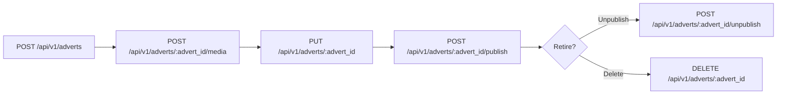
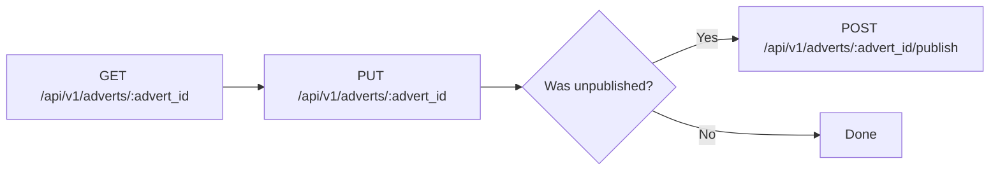
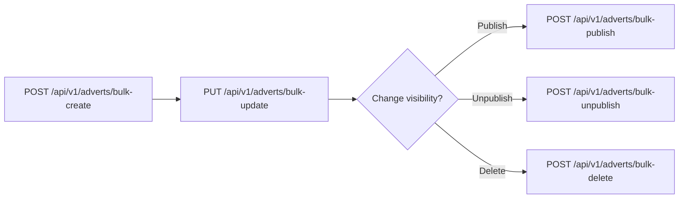

# Client API Tutorials

This repo contains small, focused scripts that exercise the Client API.
Each script maps to a single endpoint and can be run standalone from the `scripts/` folder.

## Overview

The Client API uses:
- HTTP Basic authentication (required in all environments)
- Two headers: `X-Client-Account` and `X-Client-Api-Key`

These scripts accept credentials via CLI flags or environment variables.
Interactive API documentation is available at `/docs` (Swagger UI) and `/redoc` (ReDoc) on the same host as the Client API.

## Authentication and credentials

1. Sign in to the main web app as the account owner.
2. Open Account settings and create a new Client API key (copy the secret).
3. Note the Account UID shown in your profile/settings.
4. Request the shared HTTP Basic credentials from support.

Headers used by all requests:
- `X-Client-Account`: Account UID
- `X-Client-Api-Key`: API key secret

HTTP Basic credentials are required in both staging and production.

## Configuration

Environment variables:
- `CLIENT_API_BASE_URL` (default: `http://localhost:8081/api/v1`, include `/api/v1`)
- `CLIENT_API_BASIC_USER`
- `CLIENT_API_BASIC_PASSWORD`
- `CLIENT_API_ACCOUNT`
- `CLIENT_API_KEY`

Example:
```bash
export CLIENT_API_BASE_URL="https://<host>/api/v1"
export CLIENT_API_BASIC_USER="..."
export CLIENT_API_BASIC_PASSWORD="..."
export CLIENT_API_ACCOUNT="..."
export CLIENT_API_KEY="..."
```

Note: the scripts append endpoint paths like `/adverts` to the base URL. Endpoints listed below include `/api/v1` for clarity.
There is also a `.env.example` file you can copy if you use a tool like direnv; the scripts do not load `.env` automatically.

Staging and production base URLs:
- Staging: `https://external-staging.beivo.sk/api/v1`
- Production: `https://external.beivo.sk/api/v1`

## Requirements

- Python 3.9+
- `requests` (install via `pip install -r requirements.txt`)

## Setup

```bash
python -m venv .venv
source .venv/bin/activate
pip install -r requirements.txt
```

## Quick start

Create an advert:
```bash
python scripts/client_api_create_advert.py
```

Create an advert using a payload file:
```bash
python scripts/client_api_create_advert.py --payload-file examples/brief_advert.json
```

Publish it (use the returned `advert_id`):
```bash
python scripts/client_api_publish_advert.py --advert-id "<advert_id>"
```

List adverts:
```bash
python scripts/client_api_list_adverts.py --page 1 --page-size 20
```

## Example payloads

Example files live in `examples/` and map to the CLI flags for each script.
Replace placeholder values such as `<advert_id_1>` or `<package_uid>` before using them.

- Single advert payload: `examples/brief_advert.json`
- Bulk create payload: `examples/bulk_create.json`
- Bulk update payload: `examples/bulk_update.json`
- Bulk ID list: `examples/advert_ids.json`
- Media URL list: `examples/media_urls.json`
- Package mapping payload: `examples/package_mapping.json`

Bulk create using the sample payload:
```bash
python scripts/client_api_bulk_create_adverts.py --payload-file examples/bulk_create.json
```

Bulk update using the sample payload:
```bash
python scripts/client_api_bulk_update_adverts.py --updates-file examples/bulk_update.json
```

Match packages using the sample payload:
```bash
python scripts/client_api_match_packages.py --mapping-file examples/package_mapping.json
```

## Curl quick start

Create an advert:
```bash
curl -X POST "$CLIENT_API_BASE_URL/adverts" \
  -u "$CLIENT_API_BASIC_USER:$CLIENT_API_BASIC_PASSWORD" \
  -H "X-Client-Account: $CLIENT_API_ACCOUNT" \
  -H "X-Client-Api-Key: $CLIENT_API_KEY" \
  -H "Content-Type: application/json" \
  -d @examples/brief_advert.json
```

Publish it (use the returned `advert_id`):
```bash
curl -X POST "$CLIENT_API_BASE_URL/adverts/<advert_id>/publish" \
  -u "$CLIENT_API_BASIC_USER:$CLIENT_API_BASIC_PASSWORD" \
  -H "X-Client-Account: $CLIENT_API_ACCOUNT" \
  -H "X-Client-Api-Key: $CLIENT_API_KEY"
```

## Typical client flows

1) Create → enrich → publish → retire
- Create an advert with the required fields (`POST /api/v1/adverts`).
- Enrich it with media and any optional fields (`POST /api/v1/adverts/{id}/media`, `PUT /api/v1/adverts/{id}`).
- Publish it (`POST /api/v1/adverts/{id}/publish`). The system uses the first paid package slot available.
- Retire it later by unpublishing (`POST /api/v1/adverts/{id}/unpublish`) or deleting (`DELETE /api/v1/adverts/{id}`).

2) Update an active listing
- Fetch the advert (`GET /api/v1/adverts/{id}`) to confirm the current state.
- Apply changes (`PUT /api/v1/adverts/{id}`) — e.g., price, description, features, or media.
- Re-publish if the advert was previously unpublished.

3) Bulk onboarding (high volume)
- Create many adverts in one call (`POST /api/v1/adverts/bulk-create`).
- Patch them in batches as data stabilizes (`PUT /api/v1/adverts/bulk-update`).
- Publish/unpublish/delete in batches (`POST /api/v1/adverts/bulk-*`) to control visibility.

4) Package planning and allocation
- List orders (`GET /api/v1/orders`) to see active packages and remaining slots.
- Assign adverts to specific packages (`POST /api/v1/orders/match`) when you need deterministic placement.

5) Listing management and reporting
- Paginate through adverts (`GET /api/v1/adverts`) for dashboards or sync jobs.
- Retrieve single adverts (`GET /api/v1/adverts/{id}`) for detail views or audits.

## Flow diagrams (Mermaid)

Create → enrich → publish → retire:


Update an active listing:


Bulk onboarding:


Package planning and allocation:


## Script index

| Script | Endpoint | Purpose |
| --- | --- | --- |
| `scripts/client_api_create_advert.py` | `POST /api/v1/adverts` | Create a single advert |
| `scripts/client_api_update_advert.py` | `PUT /api/v1/adverts/{advert_id}` | Update a single advert |
| `scripts/client_api_get_advert.py` | `GET /api/v1/adverts/{advert_id}` | Fetch a single advert |
| `scripts/client_api_list_adverts.py` | `GET /api/v1/adverts` | List adverts (paged) |
| `scripts/client_api_delete_advert.py` | `DELETE /api/v1/adverts/{advert_id}` | Delete a single advert |
| `scripts/client_api_publish_advert.py` | `POST /api/v1/adverts/{advert_id}/publish` | Publish a single advert |
| `scripts/client_api_unpublish_advert.py` | `POST /api/v1/adverts/{advert_id}/unpublish` | Unpublish a single advert |
| `scripts/client_api_add_media.py` | `POST /api/v1/adverts/{advert_id}/media` | Add media URLs or upload files |
| `scripts/client_api_delete_media.py` | `POST /api/v1/adverts/{advert_id}/delete-media` | Remove media URLs |
| `scripts/client_api_bulk_create_adverts.py` | `POST /api/v1/adverts/bulk-create` | Bulk create adverts |
| `scripts/client_api_bulk_update_adverts.py` | `PUT /api/v1/adverts/bulk-update` | Bulk update adverts |
| `scripts/client_api_bulk_publish_adverts.py` | `POST /api/v1/adverts/bulk-publish` | Bulk publish adverts |
| `scripts/client_api_bulk_unpublish_adverts.py` | `POST /api/v1/adverts/bulk-unpublish` | Bulk unpublish adverts |
| `scripts/client_api_bulk_delete_adverts.py` | `POST /api/v1/adverts/bulk-delete` | Bulk delete adverts |
| `scripts/client_api_list_orders.py` | `GET /api/v1/orders` | List orders and packages |
| `scripts/client_api_match_packages.py` | `POST /api/v1/orders/match` | Assign adverts to packages |

## Tips

- Run any script with `--help` to see arguments and examples.
- List responses return `meta` and `adverts`; check `meta.page_count` for pagination.
- Bulk endpoints enforce a server-side limit; default is 100 per request (`CLIENT_BULK_ADVERT_LIMIT`). Split large batches if needed.
- Rate limits apply (server-side config): `CLIENT_RATE_LIMIT_PER_MINUTE` per `CLIENT_RATE_LIMIT_WINDOW_SECONDS` (defaults: 120 per 60s, per account). If you receive `429 Too Many Requests`, slow down and retry with backoff; responses include `Retry-After`.
- Keep your API key secret and rotate it when necessary.
